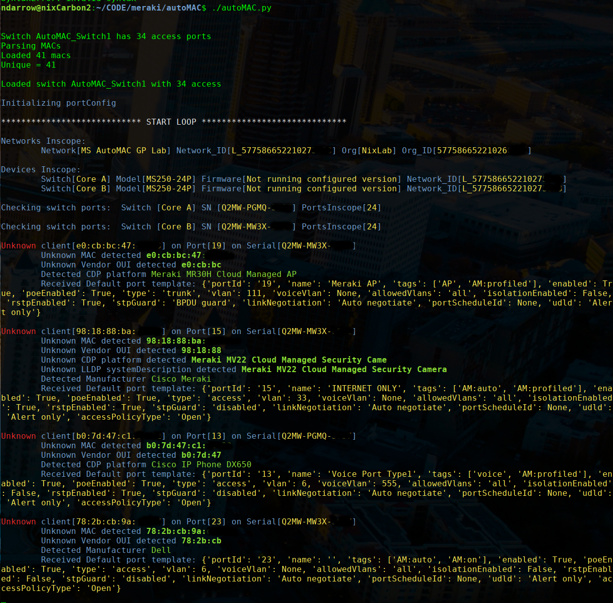

# Meraki autoMAC
Meraki autoMAC - allows you to automatically configure the switch ports on a MS network based on historical cisco switch config(show run and show mac address-table) or device profiles (OUI/CDP/LLDP/MAC/Vendor). Think of it like API based Secure-Connect. Works on any switch type.

# Different Modes
1. "History" mode, where it uses "show run" and "show mac address-table" output to identify new clients and port configurations
2. "Profile" mode, where it uses Mac address, OUI, Vendor, Manufacturer, CDP/LLDP info to assign a default profile
3. "Hybrid" mode, both of the above enabled. Configures all known devices, and uses profiles to configure anything new 

# Steps
1. place config files in local directory 'cisco/' (raw output from 'show run' and 'show mac address-table' in a "<IP> <NAME>.log" file format)
2. Configure the ORG_ID in 'autoMAC.py' to match the org your configuring
3. TAG your switch Network with "autoMAC" tag
4. TAG your switches in the Network with "autoMAC" (not tagging them will exclude them)
5. TAG your switch ports with "AM:on" to allow switch port configuration (requires them to be an access port, not TRUNK!)
6. (optional) TAG your switch ports with "AM:auto" as well as "AM:on" to have it perpetually configure port on change, otherwise it'll be one-time config
7. (optional) to disable Auto-Profiles, set "allowProfileConfigs" to 'False' in autoMAC.py
8. (optional) to disable Auto-History, set "allowHistoryConfigs" to 'False' in autoMAC.py
9. (optional) For CUSTOM profiles, edit portConfig.py and create new profiles in the init() section, examples provided
10. If you have your network, switches and ports tagged, run the script!
  
# Requirements
1. python 3.x
2. meraki SDK v1 or later for python (https://developer.cisco.com/meraki/api/#/python/getting-started)
3. install python packages ('pip3 install -r requirements.txt')

# Known caveats:
-test it first
-Try not to do CDP only profiles, there's some issues where devices that don't do CDP/LLDP might show CDP info of another device in the stack

# DEMO DEMO DEMO
* Check it out here -> https://youtu.be/HCRGmuMJFd0
